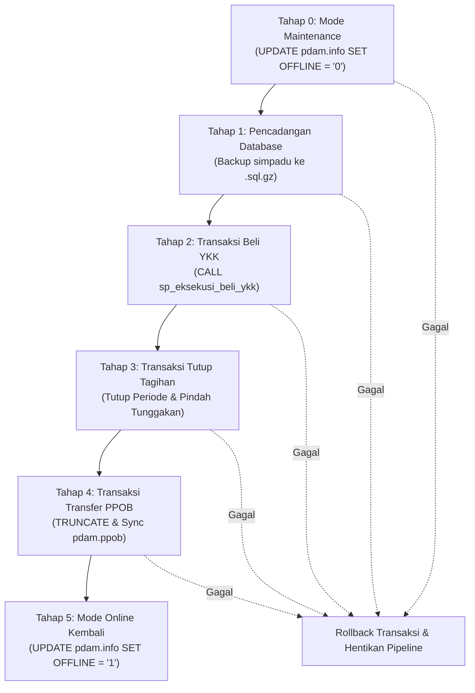

# Dokumentasi Lengkap Master Pipeline Otomasi (6-Tahapan Sekuensial)
**Sistem:** Otomasi Beli YKK, Tutup Tagihan, dan Sinkronisasi PPOB  
**Database Utama:** `simpadu` & `pdam`  
**Waktu Eksekusi Standar:** Tanggal 21 setiap bulan, pukul 00:05 WIB (atau terjadwal)

---

## 1. Diagram Alur Master Pipeline



---

## 2. Penentuan Periode Eksekusi Otomatis

Sistem secara otomatis membaca status periode aktif dari database SIMPADU:
- **Periode Aktif Database:** Dibaca dari `SELECT PERIODE FROM spd_tutuptagihan WHERE IS_TUTUP = 0 LIMIT 1` (misal: `202609`).
- **Target Periode Eksekusi:** Otomatis ditentukan dengan rumus:
  $$\text{Target Periode Eksekusi} = \text{Periode Aktif} - 1\text{ Bulan}$$
  *(Contoh: Jika periode aktif `202609`, target yang dieksekusi adalah rekening `202608`).*

---

## 3. Rincian & Perubahan Data di Setiap Tahapan

### Tahap 0: Set Mode Maintenance (Nonaktifkan Transaksi Luar)
- **Tujuan:** Mencegah terjadinya *race condition* atau transaksi pembayaran dari mitra luar/PPOB saat proses batch berlangsung.
- **Kueri:**
  ```sql
  UPDATE `pdam`.`info` SET `OFFLINE` = '0';
  ```
- **Perubahan Data:**
  - Tabel `pdam.info` kolom `OFFLINE` berubah dari `1` (Online) menjadi `0` (Offline).
  - Layanan loket mitra PPOB sementara ditutup/menolak transaksi selama proses batch berjalan.

---

### Tahap 1: Pencadangan Database (Snapshot Pengaman)
- **Tujuan:** Menyimpan cadangan penuh database `simpadu` sebagai *safety snapshot* sebelum transaksi manipulasi data dimulai.
- **Proses:** Menjalankan `mysqldump` terkompresi gzip (`.sql.gz`) secara transaksional konsisten.
- **Perubahan Data:**
  - Database tidak mengalami perubahan data (hanya *read*).
  - Berkas baru terbentuk di direktori `/backups/simpadu_YYYYMMDD_HHMMSS.sql.gz`.
  - Berkas cadangan lama yang berusia $> 14$ hari dihapus otomatis (kebijakan retensi).

---

### Tahap 2: Transaksi Beli YKK (`sp_eksekusi_beli_ykk`)
- **Tujuan:** Melunasi rekening pelanggan yang masuk kuota rencana beli YKK sesuai plafon anggaran yang ditentukan.
- **Target Periode:** $\text{Periode Aktif} - 1\text{ Bulan}$.
- **Perubahan Data:**
  1. **Tabel `spd_tagrek` (Rekening Terbayar):**
     - Ditambahkan baris baru pembayaran untuk setiap pelanggan yang masuk kuota:
       - `IS_YKK = 1` (ditandai lunas via YKK).
       - `TANGGAL = CURDATE()` (tanggal eksekusi).
       - `LOKBAY_ID = 26` (Kas YKK).
       - `STATUS_BAYAR = 'L'` (Lunas).
  2. **Tabel `spd_rekening`:**
     - Kolom `STATUS` diperbarui menjadi `'L'` (Lunas).
  3. **Tabel `ykk_log_eksekusi`:**
     - Ditambahkan 1 baris audit trail (mencatat total rekening terbeli, total tagihan pokok, denda, dan sisa budget).

---

### Tahap 3: Transaksi Tutup Tagihan (Tutup Periode & Pindah Tunggakan)
- **Tujuan:** Menutup periode tagihan lama, membuka periode baru, dan memindahkan seluruh sisa rekening yang **belum lunas** ke tabel tunggakan.
- **Perubahan Data:**
  1. **Tabel `spd_tutuptagihan`:**
     - Periode lama diupdate: `IS_TUTUP = 1, TIME_UPDATE = NOW()`.
     - Dibuat record periode baru: `PERIODE = next_periode, IS_TUTUP = 0`.
  2. **Tabel `spd_tunggak`:**
     - Rekening yang belum lunas (`FLAG = 0` dan `STATUS IN ('A','T')`) di-insert menjadi data tunggakan baru dengan perhitungan denda otomatis:
       $$\text{Denda} = \begin{cases} 5.000, & \text{jika Tagihan} \le 50.000 \\ \text{pembulatan}(10\% \times \text{Tagihan}), & \text{jika Tagihan} > 50.000 \end{cases}$$
  3. **Tabel `spd_rekening`:**
     - Rekening yang dipindahkan ke tunggakan diupdate statusnya: `FLAG = 1, IS_TUNGGAK = 1`.

---

### Tahap 4: Transaksi Transfer Tagihan ke PPOB
- **Tujuan:** Memperbarui basis data loket mitra PPOB (`pdam.ppob`) agar tagihan yang belum lunas dapat dibayarkan melalui mitra/bank.
- **Mekanisme Deteksi & Antisipasi Duplikasi:**
  1. **Deteksi Awal (Pre-Validation):** Sistem secara otomatis memeriksa apakah terdapat nomor pelanggan ganda (`NO_PDAM`) di `spd_tagrek` maupun di `spd_tunggak` pada periode yang sama. Jika ada, rincian data kembar langsung dicatat pada audit log terminal dan `pipeline_log` metadata.
  2. **Isolasi Agregasi:** Subquery `spd_rekang` diagregasi dengan `MAX()` per pelanggan untuk mencegah *cartesian product* join.
  3. **Proteksi `INSERT IGNORE`:** Mengabaikan baris duplikat yang tidak sengaja terbentuk agar eksekusi transaksi tidak terhenti/crash.
- **Perubahan Data:**
  1. **Tabel `pdam.ppob` dikosongkan:**
     ```sql
     TRUNCATE `pdam`.`ppob`;
     ```
  2. **Insert Tagihan Berjalan (Bulan Ini):**
     - Data dari `spd_tagrek` (lokbay mitra `PPOB = 3`, `IS_YKK = 0`) dimasukkan dengan kode `REK = 1`, `TRANSFER = 1`, `AKTIF = 1`.
  3. **Insert Data Tunggakan (Bulan-Bulan Lalu):**
     - Data dari `spd_tunggak` (yang belum lunas `LUNAS = 0`, mitra `PPOB = 3`) dimasukkan dengan kode `REK = 2` (Reguler) atau `REK = 3` (YKK), `TRANSFER = 0`.

---

### Tahap 5: Set Mode Online Kembali (Buka Layanan PPOB)
- **Tujuan:** Mengaktifkan kembali layanan PPOB setelah seluruh data siap dan terverifikasi 100%.
- **Kueri:**
  ```sql
  UPDATE `pdam`.`info` SET `OFFLINE` = '1';
  ```
- **Perubahan Data:**
  - Kolom `OFFLINE` di tabel `pdam.info` kembali menjadi `1` (Online).
  - Seluruh loket mitra PPOB langsung dapat melayani pembayaran dengan data tagihan terbaru.

---

## 4. Struktur Tabel Konfigurasi & Audit Trail

### Tabel `ykk_config` (Antrean & Jadwal Otomatisasi)
Tabel ini digunakan untuk mencatat antrean jadwal eksekusi otomatisasi, plafon anggaran yang dialokasikan, serta status eksekusi terakhir:

| Kolom | Tipe | Keterangan |
| :--- | :--- | :--- |
| `id` | `INT AUTO_INCREMENT` | Primary Key |
| `periode` | `VARCHAR(6)` | Periode target penutupan (e.g. `202607`) |
| `budget_plafon` | `DECIMAL(15,2)` | Batas maksimal anggaran YKK (`0` = Tanpa Batas) |
| `jadwal_eksekusi` | `DATETIME` | Waktu jadwal eksekusi (e.g. `2026-08-21 00:00:00`) |
| `status` | `ENUM` | Status jadwal: `PENDING`, `RUNNING`, `SUCCESS`, `FAILED` |
| `waktu_input` | `DATETIME` | Waktu konfigurasi didaftarkan ke sistem |
| `waktu_eksekusi` | `DATETIME` | Waktu aktual saat pipeline mulai dieksekusi |
| `pesan_terakhir` | `TEXT` | Ringkasan pesan atau status hasil eksekusi |

> **Catatan UI:** Seluruh daftar jadwal pada tabel `ykk_config` ditampilkan secara transparan di panel tabel bawah halaman **Master Pipeline & Otomasi** dan dapat diperbarui sewaktu-waktu dengan tombol **Refresh Jadwal**.

---

## 5. Berkas Implementasi Terkait

| Nama Berkas | Lokasi | Deskripsi / Fungsi |
| :--- | :--- | :--- |
| **`pipeline_runner.php`** | `/` | Mesin orkestrator utama eksekusi 6-tahap sekuensial & atomic |
| **`cron_master_pipeline.php`** | `/` | Skrip runner untuk penjadwalan berkala via server cron |
| **`backup_simpadu.php`** | `/` | Modul pembantu pencadangan database gzip stream & retensi |
| **`restore_simpadu.php`** | `/` | Modul pemulihan database dengan safety snapshot |
| **`api.php`** | `/` | Endpoint backend (`run_pipeline`, `get_pipeline_logs`, `get_config`, dll.) |
| **`index.html` & `app.js`** | `/` | Antarmuka web visual stepper 6-tahap, panel info `ykk_config`, live console, & riwayat batch |

---

## 6. Konfigurasi Cron Job Server

Untuk menjalankan pipeline otomatis setiap tanggal 21 pukul 00:05 WIB:
```bash
5 0 21 * * php /Users/tituswahyu/Documents/script/rencana_beli_ykk/cron_master_pipeline.php >> /Users/tituswahyu/Documents/script/rencana_beli_ykk/pipeline_cron.log 2>&1
```
