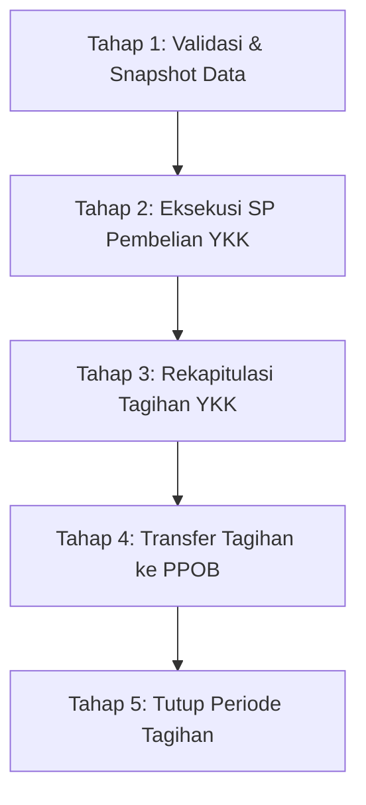
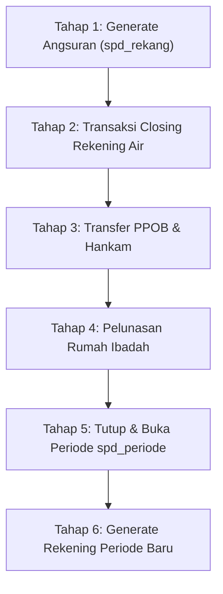

# DOKUMEN REVIEW TEKNIS: PIPELINE CLOSING TAGIHAN & CLOSING REKENING

Dokumen ini memuat rincian lengkap mengenai arsitektur, kueri SQL, tabel sumber, tabel target, logika kalkulasi, serta validasi audit untuk kedua alur pipeline penutupan sistem billing PDAM.

---

## BAGIAN I: PIPELINE CLOSING TAGIHAN (RENCANA BELI YKK - 5 TAHAP)

Pipeline ini dijalankan pada akhir periode tagihan berjalan untuk mengeksekusi otomatisasi subsidi/pembelian rekening oleh Yayasan Kesejahteraan Karyawan (YKK), sinkronisasi PPOB, dan penutupan periode tagihan.



---

### Tahap 1: Validasi Pra-Closing & Snapshot Data
* **Tujuan**: Memastikan integritas data pra-closing dan mengambil *baseline* budget YKK sebelum dieksekusi.
* **Tabel Terlibat**: `spd_config`, `spd_tagrek`, `spd_tunggak`, `spd_periode`.
* **Kueri / Logika Validasi**:
  1. *Audit Duplikasi*:
     ```sql
     -- Cek Duplikat Tagrek
     SELECT a.NO_PDAM, COUNT(*) FROM spd_tagrek a
     WHERE a.REKENING_BULAN = :periode_tagihan AND a.IS_DELETE = 0 AND a.IS_YKK = 0
     GROUP BY a.NO_PDAM HAVING COUNT(*) > 1;

     -- Cek Duplikat Tunggak
     SELECT a.NO_PDAM, COUNT(*) FROM spd_tunggak a
     JOIN spd_stlgn b ON b.ID = a.STLGN_ID
     JOIN spd_lokbay g ON g.ID = b.LOKBAY_ID
     WHERE a.LUNAS = 0 AND g.PPOB = 3 AND a.IS_DELETE = 0 AND a.PH IS NULL
     GROUP BY a.NO_PDAM, DATE_FORMAT(DATE_SUB(a.REKENING_BULAN, INTERVAL -1 MONTH), '%Y%m')
     HAVING COUNT(*) > 1;
     ```
  2. *Snapshot Budget*: Membaca nominal budget dari `spd_config WHERE key = 'budget_ykk'`.

---

### Tahap 2: Eksekusi Stored Procedure Pembelian YKK
* **Tujuan**: Mengalokasikan dana subsidi YKK ke rekening pelanggan yang memenuhi 6 kriteria eliminasi:
  1. Bukan rekening berstatus lunas (`LUNAS = 0`).
  2. Golongan tarif eligible subsidi (Rumah Tangga/Sosial tertentu).
  3. Wilayah/Kelurahan yang di-cover YKK.
  4. Batas maksimal pemakaian kubikasi ($\le 10 \text{ m}^3$).
  5. Bukan pelanggan Hankam/Instansi.
  6. Urutan prioritas tagihan terkecil hingga pagu budget habis.
* **Kueri Eksekusi**:
  ```sql
  CALL sp_eksekusi_beli_ykk(:periode_rekening, :user_id, :budget, @total_rekening, @total_nominal, @sisa_budget);
  ```
* **Dampak Data**:
  - `spd_tagrek.IS_YKK` di-update menjadi `1` untuk rekening yang terbeli.
  - `spd_tagrek.ONLINE` diset flag penanda transaksi YKK.

---

### Tahap 3: Pembuatan Rekapitulasi Tagihan YKK
* **Tujuan**: Menghitung ringkasan agregat per golongan tarif dan per kelurahan untuk pelaporan keuangan.
* **Kueri Agregasi**:
  ```sql
  SELECT 
      c.KETERANGAN AS GOLONGAN,
      COUNT(a.ID) AS JML_REKENING,
      SUM(a.AIR) AS TOTAL_AIR,
      SUM(a.ADMINISTRASI + a.PEMELIHARAAN + a.MATERAI) AS TOTAL_BIAYA,
      SUM(a.JUMLAH) AS TOTAL_TAGIHAN
  FROM spd_tagrek a
  JOIN spd_stlgn b ON b.ID = a.STLGN_ID
  JOIN spd_stgol c ON c.ID = a.STGOL_ID
  WHERE a.REKENING_BULAN = :periode_tagihan AND a.IS_YKK = 1 AND a.IS_DELETE = 0
  GROUP BY a.STGOL_ID;
  ```

---

### Tahap 4: Transaksi Transfer Tagihan ke PPOB
* **Tujuan**: Mengosongkan dan memuat ulang tabel pembayaran online (`pdam.ppob`) untuk loket mitra perbankan/PPOB.
* **Kueri SQL**:
  1. *Kosongkan PPOB*:
     ```sql
     TRUNCATE `pdam`.`ppob`;
     ```
  2. *Insert Tagihan Berjalan*:
     ```sql
     INSERT INTO `pdam`.ppob
     SELECT 
         a.NO_PDAM, b.NAMA, b.ALAMAT, CONCAT(c.KETERANGAN, ' (', d.STGOL_ID, ')') AS GOL,
         IF(d.EDITMETER = 0, d.METER, d.EDITMETER) AS MTRINI, d.METERLALU, d.VOLUME_TAGIHAN AS PAKAI,
         (d.RK + d.MATERAI) AS TAGAIR, a.NON_AIR AS TAGNONAIR,
         IFNULL(CONCAT('(', e.XANGSUR, '/', e.XRLANG, ')'), '') AS ANGS_KE, 0 AS DENDA, 
         a.SUBSIDI AS SUBSIDI, (a.JUMLAH - a.SUBSIDI) AS TOTTAG, 
         :blntag AS BLNTAG, 
         CONCAT(1, '.', a.NO_PDAM, '.', a.REKENING_BULAN, '.', LEFT(a.JUMLAH, 4)) AS NOSERIAL, 
         a.TANGGAL AS TGL_LUNAS, TIME_FORMAT(a.TIME_CREATE, '%H:%i:%s') AS TIME_LUNAS, 
         1 AS REK, IF(a.ONLINE = 0, 7, a.ONLINE) AS FLAG, 1 AS TRANSFER, a.LOKBAY_ID AS LOKBYR, 1 AS AKTIF
     FROM spd_tagrek a
     JOIN spd_stlgn b ON b.ID = a.STLGN_ID
     JOIN spd_stgol c ON c.ID = a.STGOL_ID
     JOIN spd_rekening d ON d.STLGN_ID = a.STLGN_ID AND d.PERIODE = :periode_rek AND d.`STATUS` NOT IN ('L')
     LEFT JOIN (
         SELECT a.STLGN_ID, MAX(a.XANGSUR) AS XANGSUR, MAX(a.XRLANG + 1) AS XRLANG
         FROM spd_rekang a WHERE DATE_FORMAT(a.TANGGAL, '%Y%m') = :periode_rek GROUP BY a.STLGN_ID
     ) e ON e.STLGN_ID = a.STLGN_ID
     JOIN spd_lokbay f ON f.ID = a.LOKBAY_ID
     WHERE a.REKENING_BULAN = :periode_rek AND f.PPOB = 3 AND a.IS_DELETE = 0 AND a.IS_YKK = 0
     GROUP BY a.NO_PDAM;
     ```
  3. *Insert Tunggakan Historis*:
     ```sql
     INSERT INTO `pdam`.ppob
     SELECT 
         a.NO_PDAM, b.NAMA, b.ALAMAT, CONCAT(c.KETERANGAN, ' (', a.STGOL_ID, ')') AS GOL,
         IFNULL(d.MTRINI, 0), IFNULL(d.METERLALU, 0) AS METERLALU, IFNULL(d.PAKAI, 0),
         (a.AIR + a.MATERAI) AS TAGAIR, a.NON_AIR AS TAGNONAIR,
         IFNULL(CONCAT('(', e.XANGSUR, '/', e.XRLANG, ')'), '') AS ANGS_KE, a.DENDA AS DENDA, 
         a.SUBSIDI AS SUBSIDI, (a.JUMLAH - a.SUBSIDI) AS TOTTAG,
         DATE_FORMAT(DATE_SUB(a.REKENING_BULAN, INTERVAL -1 MONTH), '%Y%m') AS BLNTAG, 
         CONCAT(IF(a.IS_YKK = 1, 3, 2), '.', a.NO_PDAM, '.', DATE_FORMAT(a.REKENING_BULAN, '%Y%m'), '.', LEFT(a.JUMLAH, 4)) AS NOSERIAL, 
         NULL AS TGL_LUNAS, NULL AS TIME_LUNAS, IF(a.IS_YKK = 1, 3, 2) AS REK, 
         0 AS FLAG, 0 AS TRANSFER, a.LOKBAY_ID AS LOKBYR, IF(f.STATUS IN ('L'), 2, 0) AS AKTIF
     FROM spd_tunggak a
     JOIN spd_stlgn b ON b.ID = a.STLGN_ID
     JOIN spd_stgol c ON c.ID = a.STGOL_ID
     LEFT JOIN (
         SELECT a.STLGN_ID, a.PERIODE, IFNULL(IF(a.EDITMETER = 0, a.METER, a.EDITMETER), 0) AS MTRINI, a.METERLALU, a.VOLUME_TAGIHAN AS PAKAI
         FROM spd_rekening a
     ) d ON d.STLGN_ID = a.STLGN_ID AND d.PERIODE = DATE_FORMAT(a.REKENING_BULAN, '%Y%m')
     LEFT JOIN (
         SELECT a.STLGN_ID, MAX(a.XANGSUR) AS XANGSUR, MAX(a.XRLANG + 1) AS XRLANG, DATE_FORMAT(a.TANGGAL, '%Y%m') AS PERIODE
         FROM spd_rekang a GROUP BY a.STLGN_ID, DATE_FORMAT(a.TANGGAL, '%Y%m')
     ) e ON e.STLGN_ID = a.STLGN_ID AND e.PERIODE = DATE_FORMAT(a.REKENING_BULAN, '%Y%m')
     LEFT JOIN (
         SELECT a.STLGN_ID, a.STATUS FROM spd_rekening a WHERE a.PERIODE = :periode_rek
     ) f ON f.STLGN_ID = a.STLGN_ID
     JOIN spd_lokbay g ON g.ID = b.LOKBAY_ID
     WHERE a.LUNAS = 0 AND g.PPOB = 3 AND a.IS_DELETE = 0 AND a.PH IS NULL
       AND NOT EXISTS (
           SELECT 1 FROM spd_tagrek tr
           WHERE tr.NO_PDAM = a.NO_PDAM AND tr.REKENING_BULAN = DATE_FORMAT(a.REKENING_BULAN, '%Y%m')
             AND tr.REKENING_BULAN = :periode_rek AND tr.IS_DELETE = 0 AND tr.IS_YKK = 0
       )
     GROUP BY a.NO_PDAM, DATE_FORMAT(DATE_SUB(a.REKENING_BULAN, INTERVAL -1 MONTH), '%Y%m')
     ORDER BY a.REKENING_BULAN;
     ```

---

### Tahap 5: Tutup Periode Tagihan Berjalan & Finalisasi
* **Tujuan**: Mengunci status pipeline transaksi tagihan.
* **Kueri SQL**:
  ```sql
  INSERT INTO spd_pipeline_logs (batch_id, pipeline_type, periode, status, waktu_selesai)
  VALUES (:batch_id, 'CLOSING_TAGIHAN', :periode, 'SUCCESS', NOW());
  ```

---

## BAGIAN II: PIPELINE CLOSING REKENING (6 TAHAP LENGKAP)

Pipeline ini adalah inti dari pergantian siklus pembacaan meter dan penagihan bulanan PDAM.



---

### Tahap 1: Pembuatan Angsuran Periode Berjalan (`spd_rekang`)
* **Tujuan**: Mengenerate rincian angsuran aktif (`spd_rekang`) dari master angsuran (`spd_angsuran`) untuk pelanggan yang masih memiliki cicilan.
* **Kueri SQL**:
  ```sql
  -- 1. Hapus angsuran pada periode berjalan jika sudah pernah digenerate
  DELETE FROM spd_rekang WHERE DATE_FORMAT(TANGGAL, '%Y%m') = :periode_berjalan;

  -- 2. Insert Angsuran Baru yang aktif (belum lunas)
  INSERT INTO spd_rekang (
      ANGSURAN_ID, STLGN_ID, TANGGAL, ANGSURKE, XANGSUR, XRLANG, NILAI, BAYAR, SISA, 
      STATUS, USER_ID_CREATE, TIME_CREATE
  )
  SELECT 
      a.ID AS ANGSURAN_ID,
      a.STLGN_ID,
      CONCAT(SUBSTR(:periode_berjalan, 1, 4), '-', SUBSTR(:periode_berjalan, 5, 2), '-01') AS TANGGAL,
      (a.AKUMBAYAR + 1) AS ANGSURKE,
      a.VOLUME AS XANGSUR,
      (a.VOLUME - a.AKUMBAYAR - 1) AS XRLANG,
      a.NILAI,
      0 AS BAYAR,
      a.NILAI AS SISA,
      'A' AS STATUS,
      :user_id AS USER_ID_CREATE,
      NOW() AS TIME_CREATE
  FROM spd_angsuran a
  WHERE a.AKUMBAYAR < a.VOLUME AND a.IS_DELETE = 0;
  ```

---

### Tahap 2: Transaksi Closing Rekening Air (`spd_rekening`)
* **Tujuan**: Mengunci seluruh rekening air pada periode berjalan:
  - Mengubah `FLAG = 1` (Terkunci/Tervalidasi).
  - Mengupdate biaya non-air dari data angsuran (`spd_rekang`).
  - Menghitung ulang Rekapitulasi Pokok (`RK = AIR + ADMINISTRASI + PEMELIHARAAN`).
  - Memastikan `FLAG` tidak bernilai NULL.
* **Kueri SQL**:
  ```sql
  -- 1. Update biaya angsuran non-air ke spd_rekening
  UPDATE spd_rekening r
  LEFT JOIN (
      SELECT STLGN_ID, SUM(NILAI) AS TOT_ANGSURAN 
      FROM spd_rekang 
      WHERE DATE_FORMAT(TANGGAL, '%Y%m') = :periode_berjalan
      GROUP BY STLGN_ID
  ) ang ON ang.STLGN_ID = r.STLGN_ID
  SET 
      r.NON_AIR = IFNULL(ang.TOT_ANGSURAN, 0),
      r.FLAG = 1,
      r.TIME_UPDATE = NOW()
  WHERE r.PERIODE = :periode_berjalan;

  -- 2. Rekalkulasi RK dan Total Tagihan
  UPDATE spd_rekening
  SET 
      RK = (AIR + ADMINISTRASI + PEMELIHARAAN),
      FLAG = 1
  WHERE PERIODE = :periode_berjalan;
  ```

---

### Tahap 3: Transaksi Transfer PPOB & Hankam
* **Tujuan**: Mentransfer tagihan berjalan dan seluruh tunggakan ke database `pdam` untuk tabel `ppob` dan `hankam`.
* **Kueri SQL**:
  1. *Audit Pra-Transfer*:
     Memastikan tidak ada duplikat `NO_PDAM` di `spd_rekening` dan `spd_tunggak` pada `BLNTAG` yang sama.
  2. *Truncate PPOB*:
     ```sql
     TRUNCATE `pdam`.`ppob`;
     ```
  3. *Insert Tagihan Berjalan*:
     ```sql
     INSERT INTO `pdam`.ppob
     SELECT 
         a.NO_PDAM, LEFT(b.NAMA, 30) AS NAMA, LEFT(b.ALAMAT, 50) AS ALAMAT, 
         LEFT(CONCAT(c.KETERANGAN, ' (', a.STGOL_ID, ')'), 40) AS GOL,
         IF(a.EDITMETER = 0, a.METER, a.EDITMETER) AS MTRINI, a.METERLALU, a.VOLUME_TAGIHAN AS PAKAI, 
         (a.RK + a.MATERAI) AS TAGAIR, a.NON_AIR AS TAGNONAIR,
         IFNULL(CONCAT('(', d.XANGSUR, '/', d.XRLANG, ')'), 0) AS ANGS_KE, 0 AS DENDA, 
         a.SUBSIDI AS SUBSIDI, (a.RK + a.NON_AIR + a.MATERAI - a.SUBSIDI) AS TOTTAG, 
         :blntag AS BLNTAG, 
         CONCAT(1, '.', a.NO_PDAM, '.', a.PERIODE, '.', LEFT((a.RK + a.NON_AIR + a.MATERAI), 4)) AS NOSERIAL,
         NULL AS TGL_LUNAS, NULL AS TIME_LUNAS, 1 AS REK, 0 AS FLAG,
         0 AS TRANSFER, a.LOKBAY_ID AS LOKBYR, 0 AS AKTIF
     FROM spd_rekening a
     JOIN spd_stlgn b ON b.ID = a.STLGN_ID
     JOIN spd_stgol c ON c.ID = a.STGOL_ID
     LEFT JOIN (
         SELECT a.STLGN_ID, MAX(a.XANGSUR) AS XANGSUR, MAX(a.XRLANG + 1) AS XRLANG 
         FROM spd_rekang a
         WHERE DATE_FORMAT(a.TANGGAL, '%Y%m') = :periode_tagihan AND a.XANGSUR > 0
         GROUP BY a.STLGN_ID
     ) d ON d.STLGN_ID = a.STLGN_ID
     JOIN spd_lokbay e ON e.ID = a.LOKBAY_ID
     WHERE a.PERIODE = :periode_tagihan AND a.`STATUS` NOT IN ('L') AND e.PPOB = 3 AND a.FLAG = 0
     GROUP BY a.NO_PDAM;
     ```
  4. *Insert Tunggakan Historis*:
     ```sql
     INSERT INTO `pdam`.ppob
     SELECT 
         a.NO_PDAM, LEFT(b.NAMA, 30) AS NAMA, LEFT(b.ALAMAT, 50) AS ALAMAT,
         LEFT(CONCAT(c.KETERANGAN, ' (', a.STGOL_ID, ')'), 40) AS GOL,
         IFNULL(d.MTRINI, 0) AS MTRINI, IFNULL(d.METERLALU, 0) AS METERLALU, IFNULL(d.PAKAI, 0) AS PAKAI,
         (a.AIR + a.MATERAI) AS TAGAIR, a.NON_AIR AS TAGNONAIR,
         IFNULL(CONCAT('(', e.XANGSUR, '/', e.XRLANG, ')'), '') AS ANGS_KE, a.DENDA AS DENDA, 
         a.SUBSIDI AS SUBSIDI, (a.JUMLAH - a.SUBSIDI) AS TOTTAG,
         DATE_FORMAT(DATE_SUB(a.REKENING_BULAN, INTERVAL -1 MONTH), '%Y%m') AS BLNTAG, 
         CONCAT(IF(a.IS_YKK=1, 3, 2), '.', a.NO_PDAM, '.', DATE_FORMAT(a.REKENING_BULAN, '%Y%m'), '.', LEFT(a.JUMLAH, 4)) AS NOSERIAL,
         NULL AS TGL_LUNAS, NULL AS TIME_LUNAS, IF(a.IS_YKK=1, 3, 2) AS REK, 0 AS FLAG,
         0 AS TRANSFER, a.LOKBAY_ID AS LOKBYR, IF(f.STATUS IN ('L'), 2, 0) AS AKTIF
     FROM spd_tunggak a
     JOIN spd_stlgn b ON b.ID = a.STLGN_ID
     JOIN spd_stgol c ON c.ID = a.STGOL_ID
     LEFT JOIN (
         SELECT a.STLGN_ID, a.PERIODE, IFNULL(a.EDITMETER, a.METER) AS MTRINI, a.METERLALU, a.VOLUME_TAGIHAN AS PAKAI
         FROM spd_rekening a
     ) d ON d.STLGN_ID = a.STLGN_ID AND d.PERIODE = DATE_FORMAT(a.REKENING_BULAN, '%Y%m')
     LEFT JOIN (
         SELECT a.STLGN_ID, MAX(a.XANGSUR) AS XANGSUR, MAX(a.XRLANG + 1) AS XRLANG, DATE_FORMAT(a.TANGGAL, '%Y%m') AS PERIODE
         FROM spd_rekang a
         WHERE a.XANGSUR > 0
         GROUP BY a.STLGN_ID, DATE_FORMAT(a.TANGGAL, '%Y%m')
     ) e ON e.STLGN_ID = a.STLGN_ID AND e.PERIODE = DATE_FORMAT(a.REKENING_BULAN, '%Y%m')
     LEFT JOIN (
         SELECT a.STLGN_ID, a.STATUS FROM spd_rekening a WHERE a.PERIODE = :periode_tagihan
     ) f ON f.STLGN_ID = a.STLGN_ID
     JOIN spd_lokbay g ON g.ID = b.LOKBAY_ID
     WHERE a.LUNAS = 0 AND g.PPOB = 3 AND a.IS_DELETE = 0 AND a.PH IS NULL
     GROUP BY a.NO_PDAM, DATE_FORMAT(DATE_SUB(a.REKENING_BULAN, INTERVAL -1 MONTH), '%Y%m')
     ORDER BY a.REKENING_BULAN;
     ```
  5. *Insert Hankam (`pdam.hankam`)*:
     Memasukkan rekening Satker Militer/Hankam untuk Loket `A` (Umum), `M` (AKMIL), dan `MA` (Dodik).

---

### Tahap 4: Pelunasan Rekening Rumah Ibadah
* **Tujuan**: Menggratiskan/melunaskan rekening tempat ibadah (Golongan IB1, IB2, IB3 dan sambungan khusus) dengan menandai `FLAG = 9` (Lunas Khusus PDAM).
* **Kueri SQL**:
  ```sql
  -- Pelunasan di tabel PPOB
  UPDATE `pdam`.`ppob` 
  SET FLAG = 9 
  WHERE REK = 1 
    AND (
      GOL LIKE '%(IB1)%' 
      OR GOL LIKE '%(IB2)%' 
      OR GOL LIKE '%(IB3)%'
      OR IDLGN IN ('12010151')
    );

  -- Pelunasan di tabel spd_rekening
  UPDATE spd_rekening r
  JOIN spd_stgol g ON g.ID = r.STGOL_ID
  SET 
      r.STATUS = 'L',
      r.FLAG = 9,
      r.TGL_LUNAS = CURDATE(),
      r.USER_ID_UPDATE = :user_id,
      r.TIME_UPDATE = NOW()
  WHERE r.PERIODE = :periode_berjalan
    AND (
      g.ID IN ('IB1', 'IB2', 'IB3')
      OR r.NO_PDAM IN ('12010151')
    );
  ```

---

### Tahap 5: Tutup Periode Berjalan & Buka Periode Baru
* **Tujuan**: Memperbarui tabel status master `spd_periode`:
  1. Menutup periode berjalan (`IS_TUTUP = 1`, `TGL_TUTUP = NOW()`).
  2. Membuka / mengaktifkan record periode bulan berikutnya (`IS_TUTUP = 0`).
* **Kueri SQL**:
  ```sql
  -- 1. Tutup Periode Berjalan
  UPDATE spd_periode
  SET 
      IS_TUTUP = 1,
      TGL_TUTUP = NOW(),
      USER_ID_UPDATE = :user_id,
      TIME_UPDATE = NOW()
  WHERE TAHUN = :tahun AND BULAN = :bulan;

  -- 2. Buka Periode Baru (+1 Bulan)
  UPDATE spd_periode
  SET 
      IS_TUTUP = 0,
      TGL_BUKA = NOW(),
      USER_ID_UPDATE = :user_id,
      TIME_UPDATE = NOW()
  WHERE TAHUN = :next_tahun AND BULAN = :next_bulan;
  ```

---

### Tahap 6: Inisialisasi Rekening Periode Baru (`spd_rekening`)
* **Tujuan**: Membuat kerangka data rekening air untuk bulan penagihan berikutnya bagi seluruh pelanggan aktif (`STATUS_PELANGGAN = 'A'`):
  - Menggeser meteran kini menjadi meteran lalu (`METERLALU = METER`).
  - Mengosongkan volume dan tagihan air (`METER = 0`, `VOLUME_TAGIHAN = 0`, `AIR = 0`).
  - Menyiapkan meteran untuk pembacaan stand meter baru (`IS_CTRL = 0`).
* **Kueri SQL**:
  ```sql
  INSERT INTO spd_rekening (
      STLGN_ID, NO_PDAM, PERIODE, LOKBAY_ID, STGOL_ID, 
      METERLALU, METER, EDITMETER, VOLUME_TAGIHAN, AIR, 
      ADMINISTRASI, PEMELIHARAAN, MATERAI, NON_AIR, RK, SUBSIDI, 
      STATUS, FLAG, IS_CTRL, IS_DELETE, TIME_CREATE
  )
  SELECT 
      a.ID AS STLGN_ID,
      a.NO_PDAM,
      :periode_baru AS PERIODE,
      a.LOKBAY_ID,
      a.STGOL_ID,
      IFNULL(r_lama.METER, 0) AS METERLALU,
      0 AS METER,
      0 AS EDITMETER,
      0 AS VOLUME_TAGIHAN,
      0 AS AIR,
      g.ADMINISTRASI,
      g.PEMELIHARAAN,
      0 AS MATERAI,
      0 AS NON_AIR,
      (g.ADMINISTRASI + g.PEMELIHARAAN) AS RK,
      0 AS SUBSIDI,
      'A' AS STATUS,
      0 AS FLAG,
      0 AS IS_CTRL,
      0 AS IS_DELETE,
      NOW() AS TIME_CREATE
  FROM spd_stlgn a
  JOIN spd_stgol g ON g.ID = a.STGOL_ID
  LEFT JOIN spd_rekening r_lama ON r_lama.STLGN_ID = a.ID AND r_lama.PERIODE = :periode_berjalan
  WHERE a.FLAG = 'A' AND a.IS_DELETE = 0;
  ```

---

## BAGIAN III: MATRIKS VALIDASI & INTEGRITAS DATA

| Parameter Audit | Kueri Deteksi | Tindakan Jika Gagal |
| :--- | :--- | :--- |
| **Kontrol Stand Meter** | `SELECT COUNT(*) FROM spd_rekening WHERE PERIODE = :p AND IS_CTRL = 0` | Menolak Closing Rekening sampai 100% meter terkontrol |
| **Duplikasi Rekening Aktif** | `GROUP BY a.NO_PDAM HAVING COUNT(*) > 1` di `spd_rekening` | Batalkan transaksi dan laporkan nomor sambungan ganda |
| **Duplikasi Tunggakan PPOB** | `GROUP BY a.NO_PDAM, BLNTAG HAVING COUNT(*) > 1` di `spd_tunggak` | Batalkan transaksi dan cegah Primary Key Collision |
| **Duplikasi Angsuran** | `GROUP BY a.STLGN_ID, a.KRITERIA, a.PERIODE HAVING COUNT(*) > 1` di `spd_angsuran` | Tampilkan daftar cicilan ganda pada tab audit |
| **Strict SQL Mode** | Tidak ada `INSERT IGNORE` di seluruh pipeline | Memastikan setiap anomali tertangkap transparan di audit |
